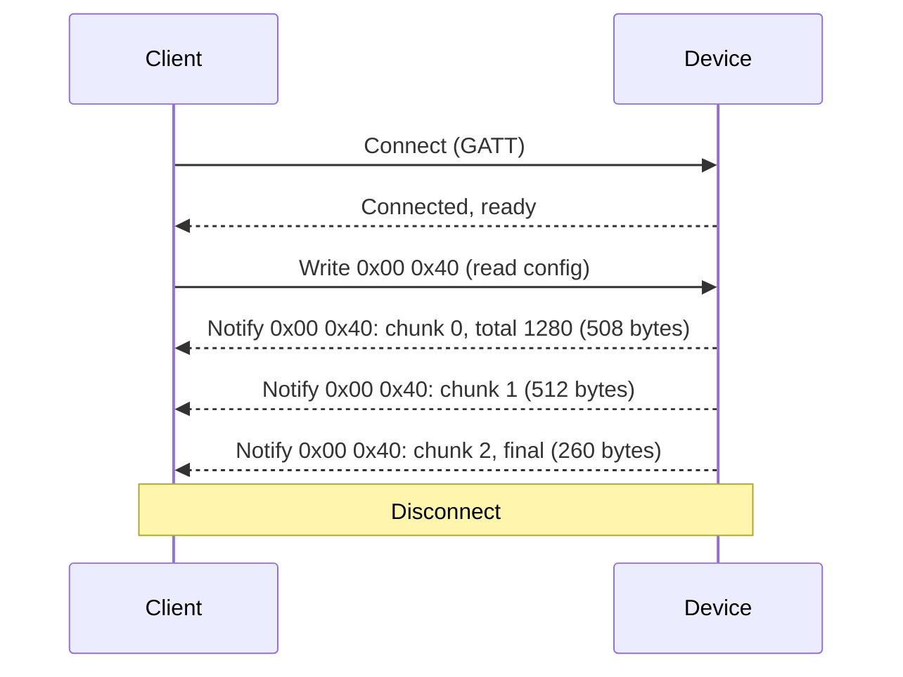
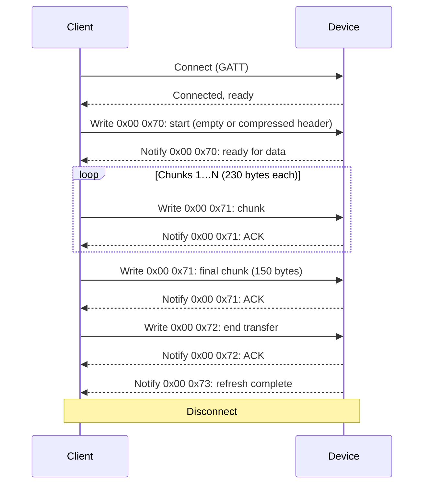
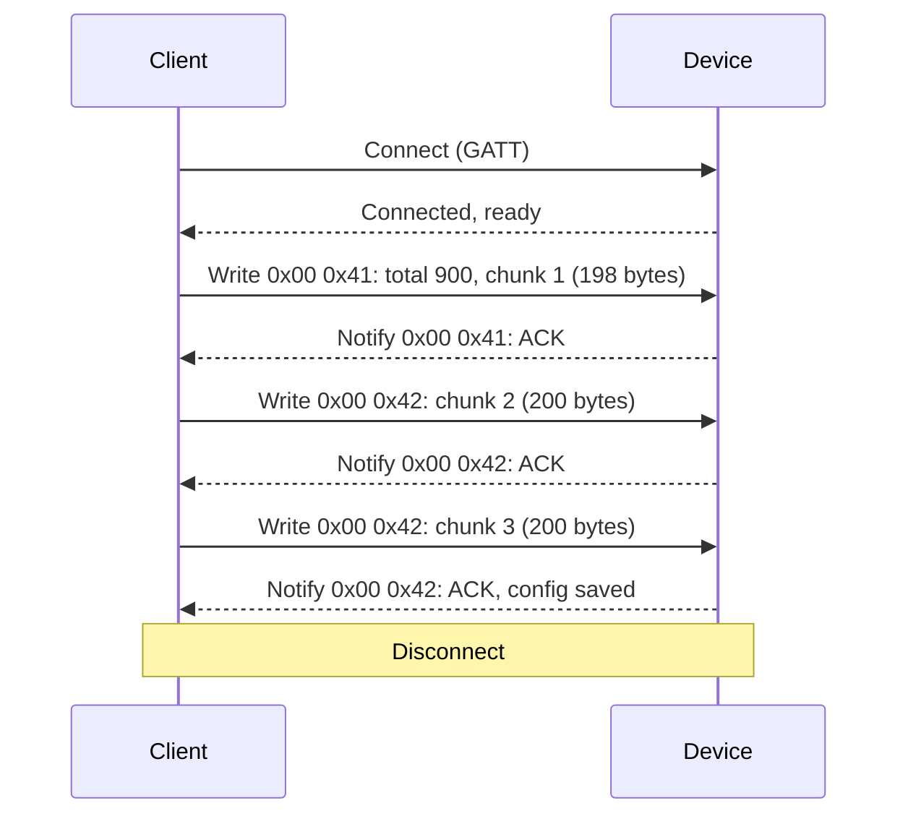

## Overview

This document defines how clients talk to OpenDisplay devices over **Bluetooth Low Energy** (GATT) and, when enabled, over **Wi‑Fi** as a **TCP client to the device** (the device is the TCP server). After connection setup, the **byte-level command and response format is the same** on both transports: configuration read/write, direct write image transfer, encryption session rules, and error responses.

#### Reference firmware

The open-source reference firmware stores device capabilities as a **[Flex](/protocol/flex-standard/)** configuration blob (YAML → binary TLV). Clients still use the commands in this document; Flex only defines what is inside the configuration packet.

For a minimal fixed-product profile, see **[OpenDisplay](/protocol/basic-standard.html)** (its Wi‑Fi appendix describes a different, pull-based model; reference firmware follows the LAN rules below).

<h2 id="lan-wifi-transport">LAN (Wi‑Fi) transport</h2>

On supported devices (e.g. ESP32 with Flex firmware), Wi‑Fi adds a second path for the *same* protocol bytes that would otherwise be written to the BLE characteristic. Use this when the device is on the same IPv4 LAN as the client.

### Enabling Wi‑Fi in configuration

#### `communication_modes` and `wifi_config`

In [system configuration](/protocol/yaml-config/), **bit 2** of `communication_modes` (`wifi`) must be set to advertise that the device supports Wi‑Fi transfer. The saved configuration must also include **packet type 38** (`wifi_config`, ID `0x26`) with a **non-empty SSID** (and password / encryption type as appropriate). Devices typically receive this over BLE once; after reboot they join the access point as a station (STA).

The TCP listen port defaults to **2446** in reference firmware unless overridden by implementation.

### Discovery (mDNS)

#### Service advertised by the device

Once associated to Wi‑Fi, the device advertises mDNS so clients can find it without a fixed IP:

-   **Hostname:** `OD` + device chip ID in hex, e.g. `ODa1b2c3d4e5f.local`
-   **Service type:** `_opendisplay._tcp` (PTR/SRV on the local domain)
-   **Port:** TCP port (default `2446`)
-   **TXT `msd`:** 28 lowercase hexadecimal characters (14 bytes) derived from manufacturer specific data for disambiguation when several devices are on the network

Clients should browse for `_opendisplay._tcp`, resolve the target host and port, then open a TCP connection to the device. You may also connect by IP if you already know it.

### TCP framing

#### Length-prefixed payloads

The TCP byte stream is a sequence of frames:

```
Each frame:
[payload_length: 2 bytes, little-endian][payload: payload_length bytes]

payload_length must be from 1 to 4096 (inclusive).
payload is exactly the same blob as a single BLE write to the OpenDisplay characteristic
(raw command bytes as used elsewhere in this document).
```

Partial frames are buffered until complete. Multiple frames may arrive in one socket read. A new TCP connection replaces any previous one; only one client session is served at a time. Because each frame may carry up to 4096 bytes of payload, a single LAN frame can hold a larger command chunk than a typical BLE ATT write; the command IDs and inner layout are unchanged.

### Responses and encryption

#### Same semantics as BLE

Device responses are sent on the TCP socket as **one frame per response**, using the same framing (`length` + payload). Payload format matches BLE notifications (including application-layer encryption when a session is active). Clients must parse RX the same way as BLE notify payloads.

If the radio link drops or the device restarts, the TCP connection closes; the client should reconnect and, if using encryption, re-establish the session as after a BLE disconnect. Details: [Encryption and authentication](#encryption-authentication).

<h2 id="encryption-authentication">Encryption and authentication</h2>

Devices may store **[packet type 39](/protocol/yaml-config/#packet-type-39)** (`security_config`, ID `0x27`): a 16-byte **AES-128 pre-shared key** and an `encryption_enabled` flag. If the key is **all zero**, encryption is treated as off regardless of the flag. When encryption is **on**, almost every command requires an authenticated session; payloads are protected with **AES-CCM** (13-byte nonce, 12-byte tag, 2-byte associated data = command ID).

### Commands allowed without a session

-   **`0x0050` Authenticate** — challenge/response handshake (always unencrypted on the wire).
-   **`0x0043` Firmware version** — read-only, always unencrypted.

Any other command while encryption is enabled must be sent **after** a successful `0x0050` flow, in the encrypted form below. If the client is not authenticated, the device typically answers with status `0xFE` on the low byte of the response (see [response codes](#response-codes-auth)).

### Config writes without authentication (optional)

#### `rewrite_allowed` flag

If `security_config.flags` bit 0 (`rewrite_allowed`) is set, the device may allow **unauthenticated** configuration writes (`0x0041` / `0x0042`) as a recovery path: reference firmware may erase existing config when such a write arrives without a session. When the bit is clear, unauthenticated config writes are rejected with `0xFE` while encryption is enabled.

### Session lifetime

-   **Timeout:** `session_timeout_seconds` in `security_config` (0 = no timeout until disconnect).
-   **Disconnect:** BLE disconnect or LAN TCP close clears the session; the client must run `0x0050` again.
-   **Config saved:** After a successful config write and reload, reference firmware clears the session.
-   **Integrity:** Repeated decrypt/nonce failures (reference firmware: three) clear the session.

### Authenticate command `0x0050`

All authenticate messages use the usual command header `0x00 0x50` plus a payload. Responses use `0x00 0x50` and a status byte in the third octet unless noted.

#### Step 1 — Client requests a challenge

**Write payload:** single byte `0x00` after `0x00 0x50`.

**Device response (success):** `0x00 0x50 0x00`, then **16 bytes** server nonce (random), then **4 bytes** device ID (derived from chip identity; used in MAC inputs).

**Other `0x0050` statuses:** `0x03` — encryption disabled; `0x04` — rate limited (too many attempts within a short window).

#### Step 2 — Client proves knowledge of the pre-shared key

Within **30 seconds** of step 1, the client sends **32 bytes**: its own random **client\_nonce** (16 bytes) concatenated with **challenge\_response** (16 bytes), where:

```
challenge_response = AES-128-CMAC(psk, server_nonce || client_nonce || device_id)
// server_nonce: 16 B from step 1
// client_nonce: 16 B client random
// device_id: 4 B from step 1 response
// total CMAC input length: 36 bytes
```

The device recomputes the same CMAC with the stored key. On mismatch it responds with `0x00 0x50 0x01` and aborts. On success it derives a **session key** and **session ID** from the PSK and both nonces (reference: KDF in firmware `deriveSessionKey` / `deriveSessionId`), marks the session authenticated, and sends:

**Device response:** `0x00 0x50 0x00` followed by 16 bytes:

```
server_proof = AES-128-CMAC(session_key, server_nonce || client_nonce || device_id)
```

The client should verify `server_proof` the same way before trusting the channel.

**Errors:** `0x00 0x50 0xFF` — bad format, expired nonce, or internal failure.

### Encrypted commands (after authentication)

#### Wire layout (BLE write or LAN frame inner payload)

```
[cmd_hi][cmd_lo][nonce_full: 16 bytes][ciphertext: variable][auth_tag: 12 bytes]

• cmd_hi/cmd_lo: same big-endian command as plaintext mode (e.g. 0x00 0x40).
• nonce_full: 8-byte session ID (from handshake) + 8-byte big-endian counter (client-chosen for writes).
AES-CCM uses the last 13 bytes of nonce_full (bytes 3–15) as the CCM nonce.
• Associated data (AD) for CCM: the two command bytes [cmd_hi][cmd_lo].
• ciphertext: AES-CCM encryption of [L][payload…] where L = length of command-specific payload (one byte),
followed by that many payload bytes (the same bytes that would follow the command in plaintext mode).
• Encrypted payload size per command is limited in reference firmware (e.g. 512 bytes including length byte).
```

The device checks the nonce (session ID + replay window around the last seen counter) before decrypting. After decrypt, processing is identical to plaintext commands.

### Encrypted responses

#### When responses are encrypted

Once authenticated, the device encrypts **most** responses the same way: layout `[cmd_hi][cmd_lo][nonce_full: 16][ciphertext…][tag: 12]`, where the plaintext inside CCM is `[L][rest…]` with `L` = number of bytes after the command in the unencrypted response. The device uses its own monotonic counter in the nonce for responses.

**Left unencrypted** (reference firmware): authenticate (`0x0050`), firmware version (`0x0043`), and responses whose status byte is `0xFE` or `0xFF` (errors / not authenticated).

## BLE connection establishment

### 1\. Device Discovery

#### Scan for Devices

The client scans for BLE devices with names starting with "OD" (OpenDisplay prefix). Devices advertise with the service UUID `0x2446`.

```
Service UUID: 0x2446
Characteristic UUID: 0x2446
Device Name: OD[chip_id]
```

### 2\. GATT Connection

#### Connect to GATT Server

Once a device is selected, the client connects to the device's GATT server and discovers the primary service.

```
1. Connect to GATT Server
2. Get Primary Service (0x2446)
3. Get Characteristic (0x2446)
4. Start Notifications
```

### 3\. Notification Setup

#### Enable Notifications

The client enables notifications on the characteristic to receive responses from the device. All device responses are sent via notifications.

## Configuration Reading Flow

### 1\. Send Read Command

#### Command: 0x0040

The client sends a read config command to request the device's current configuration.

```
Command: 0x00 0x40
```

### 2\. Receive Config Chunks

#### Chunked Response

The device responds with configuration data in chunks. The first chunk contains:

-   Response type: `0x00` (success)
-   Command: `0x40`
-   Chunk number: `0x0000` for first chunk
-   Total length: 2 bytes (little-endian)
-   Config data: variable length

Subsequent chunks contain chunk number and data only. Each chunk is up to 512 bytes (minus headers).

**Required Configuration:** The configuration must include a display packet ([Packet Type 32](/protocol/yaml-config/#packet-type-32)) that defines the display dimensions, color scheme, and other display-specific parameters. This is mandatory for the protocol to function correctly. See the [YAML Configuration Documentation](/protocol/yaml-config/) for complete packet definitions.

### 3\. Reconstruct Configuration

#### Assemble Chunks

The client collects all chunks and reconstructs the complete configuration packet. The configuration is validated using CRC16-CCITT checksum.

### 4\. Parse Configuration

#### Decode Packet Structure

The reconstructed bytes are parsed according to the [protocol specification](/protocol/yaml-config/):

-   Length (2 bytes)
-   Version (1 byte)
-   Packets (variable, sequence of single packets)
-   CRC (2 bytes)

Each single packet contains a packet number, packet ID, and payload specific to that packet type. See the [Packet Structure](/protocol/yaml-config/#packet-structure) section for detailed information.

**Display Configuration Requirement:** The configuration must contain a display packet ([Packet Type 32](/protocol/yaml-config/#packet-type-32)) that specifies the display dimensions, color scheme, and refresh capabilities. Without this information, clients cannot properly format and send image data to the device. See the [YAML Configuration Documentation](/protocol/yaml-config/) for details on packet structure.

## Configuration Writing Flow

### 1\. Prepare Configuration

#### Build Packet

The client builds a configuration packet containing all required and optional packet types. The packet is encoded with length, version, packet sequence, and CRC.

**Required Packet:** The configuration must include a display packet ([Packet Type 32](/protocol/yaml-config/#packet-type-32)) with display dimensions, color scheme, and refresh mode. This is essential for the device to know how to process incoming image data. See the [YAML Configuration Documentation](/protocol/yaml-config/) for details on all packet types.

### 2\. Send Configuration

#### Write Command: 0x0041

For small configurations (&lt;200 bytes), the entire packet is sent in one command:

```
Command: 0x00 0x41
Payload: [config bytes]
```

For larger configurations, chunked transmission is used:

-   First chunk (0x0041): Contains total size (2 bytes) + first 200 bytes
-   Subsequent chunks (0x0042): Contains remaining data in 200-byte chunks

### 3\. Device Processing

#### Apply Configuration

The device validates the configuration, checks CRC, and stores it in non-volatile memory. A reboot command (0x000F) may be sent to apply the new configuration.

<h2 id="image-transfer">Image Transfer Flow</h2>

Reference firmware implements **direct write** only: image bytes stream straight into the panel framebuffer via `0x0070` → `0x0071` → `0x0072`. Pixel layout is defined in [Display data format](/protocol/display-data-format/). Panel width, height, and color scheme come from the loaded Flex [display packet (type 32)](/protocol/yaml-config/#packet-type-32) — the client does not send dimensions in the start command.

### 1\. Direct write (uncompressed)

#### Start: `0x0070`

Empty payload (or fewer than 4 bytes). Device powers the panel, opens the full address window, and ACKs.

```
Command: 0x00 0x70
Payload: (empty)
```

Response: `0x00 0x70`

#### Data: `0x0071`

Raw encoded pixels in row-major order. Chunk until the full frame size is sent.

```
Command: 0x00 0x71
Payload: [pixel bytes]
BLE: up to ~230 bytes per chunk (less when encryption is on)
LAN: up to ~1000 bytes per chunk
```

Response after each chunk: `0x00 0x71`. On the uncompressed path the device may auto-complete when the expected byte count is reached.

#### End: `0x0072`

```
Command: 0x00 0x72
Payload (optional):
[refresh_mode: 1 byte]  — 0 = full (default), 1 = fast refresh
[new_etag: 4 bytes, big-endian] — optional; seeds partial-update state
```

Response: `0x00 0x72` (ACK), then the device refreshes the panel. After refresh completes: `0x00 0x73` (success) or `0x00 0x74` (timeout, ~60 s).

<h3 id="streaming-decompression">2. Streaming decompression (compressed direct write)</h3>

#### Sender guidance

**New senders must not use legacy compression** (standard zlib with a large DEFLATE history window). If the device does not advertise `streaming_decompression` in Flex `transmission_modes`, send an **uncompressed** direct write instead.

**Deprecation:** Reference firmware **version 1.x** (from `0x0043`, major in the high byte) still accepts legacy large-window zlib on existing ESP32/nRF builds. **Firmware version 2** will remove that path; only streaming decompression (512-byte DEFLATE window) will remain. Plan client upgrades before moving to v2 firmware.

When both `streaming_decompression` (bit 0) and `zip` (bit 1) are set in the display `transmission_modes` field, the client may send a zlib DEFLATE stream. The device decompresses **incrementally** as `0x0071` chunks arrive and writes decoded pixels directly to the panel — no full-image RAM buffer on the device.

#### Start: `0x0070` (compressed)

```
Command: 0x00 0x70
Payload:
[uncompressed_size: 4 bytes, little-endian] — must match frame size from Flex config
[zlib bytes: optional] — remainder of start command may hold the first part of the DEFLATE stream
```

Client compression must use a **512-byte DEFLATE window** (`window_bits = 9` in zlib/pako). Response: `0x00 0x70`.

#### Data: `0x0071` (zlib stream)

Continuation of the zlib stream (not pre-decompressed pixels). ACK per chunk: `0x00 0x71`.

#### End: `0x0072`

Same optional refresh mode and `new_etag` as uncompressed direct write. Finalize the zlib stream, refresh, then `0x73`/`0x74`.

The same streaming path applies to [partial region updates](#partial-update) when the `0x0076` flags byte has bit 0 set. See also [Display data format — transmission](/protocol/display-data-format/#transmission-reference).

<h3 id="partial-update">3. Partial region update (<code>0x0076</code>)</h3>

For 1 bpp B/W panels that support differential partial refresh, the client can update a rectangular region instead of the full frame. Requires `partial_update_support: 1` (region updates) or `2` (full-frame stream required) in Flex config (main reference firmware only; see [firmware variants](/protocol/reference-firmware-variants/)).

#### Region strategy: check `partial_update_support`

The display config enum tells the client which region strategy the panel supports: `1` = arbitrary rectangular regions; `2` = partial updates supported but the stream **must cover the full panel** (`x=0, y=0, w=panel_width, h=panel_height`, both planes). Value `2` exists because the firmware white-fills both controller RAM planes at partial start, and on some panels (e.g. EP426 / Seeed EN05) the partial waveform erases everything the stream does not cover — while every protocol response still ACKs. A full-frame partial still refreshes with the flicker-free partial waveform; the stream zlib-compresses well for typical content. Background: [Firmware issue #80](https://github.com/OpenDisplay/Firmware/issues/80).

⚠️ Device configs written before this enum value existed may report `1` on affected panels. When targeting unknown devices, treat region updates on such panels with care or default to full-frame streams.

#### Start: `0x0076`

```
Command: 0x00 0x76
Payload (17-byte header + optional stream bytes):
[flags: 1 byte] — bit 0 = zlib-compressed stream (requires zip in transmission_modes)
[old_etag: 4 bytes, big-endian] — must match device displayed etag
[new_etag: 4 bytes, big-endian] — non-zero; committed on success
[x: 2][y: 2][w: 2][h: 2] — region, big-endian; x and w must be multiples of 8
[optional initial stream bytes]
```

Response: `0x00 0x76`. NACK: `0xFF 0x76 [error] 0x00` (see error table below).

#### Stream via `0x0071`

Logical stream size = `plane_size × 2` where `plane_size = ceil(w/8) × h` bytes. **First half** = old image bits for the region (controller plane 1). **Second half** = new image bits (controller plane 0). Same chunking as full-frame direct write.

#### End: `0x0072`

Optional byte 0: refresh mode — default is **partial** region refresh; `0` = full panel, `1` = fast. No `new_etag` in this end payload (etag comes from the `0x0076` header). Responses: `0x00 0x72`, then `0x00 0x73` or `0x00 0x74`. On success, `displayed_etag = new_etag`.

#### Partial update error codes

| Code | Meaning |
| --- | --- |
| `0x01` | Etag mismatch |
| `0x03` | Rectangle out of bounds |
| `0x04` | `x` or `w` not 8-pixel aligned |
| `0x05` | Invalid flags or compression not allowed |
| `0x06` | Stream size or zlib error |
| `0x07` | Panel not 1 bpp (unsupported) |

**Etag lifecycle:** After a successful full frame, the client may supply `new_etag` in the `0x0072` end payload. Partial updates must send matching `old_etag`. On refresh timeout (`0x74`) the device clears the etag; the client should fall back to a full refresh.

### 4\. Block upload (not in reference firmware)

#### Commands `0x0064` / `0x0065`

Defined for implementations that buffer the full image before refresh. Reference firmware does not implement these opcodes: they fall through to the unknown-command path, which sends **no response**. A client must not wait for a reply — these are silently ignored.

<h2 id="firmware-variants-summary">Reference firmware variants</h2>

ESP32/nRF and Silicon Labs BG22 builds share this command set but differ in optional features (partial refresh, NFC, Wi‑Fi/LAN, compression window limits). Full matrix: [Reference firmware variants](/protocol/reference-firmware-variants/).

<h2 id="nfc-endpoint">NFC endpoint (<code>0x0083</code>)</h2>

BG22 firmware only (requires Flex NFC config `0x2A`). Opcode is **`0x0083`** — do not use `0x0082` (that is PIPE\_WRITE end).

#### Sub-opcodes

-   `0x00` — Read current NDEF record
-   `0x01` — Inline write: `[rec_type][len16 BE][payload…]` (payload ≤ 120 B)
-   `0x10` — Chunked write start: `[rec_type][total_len16 BE]` (total ≤ 512 B)
-   `0x11` — Chunked write data: payload bytes (≤ 120 B per frame)
-   `0x12` — Chunked write end / commit

`rec_type`: `0` Text, `1` URI, `2` Well-known raw, `3` MIME, `4` Raw NDEF.

#### Responses

-   Read OK: `0x00 0x83 0x80 [rec_type][len16 BE][payload…]`
-   Write committed: `0x00 0x83 0x81` (inline write or chunked end)
-   Chunk stage ACK: `0x00 0x83 0x82` (start / data accepted)
-   Error: `0xFF 0x83 0xFF [err]` — `1` malformed, `2` read fail, `3` write fail, `4` unknown sub, `5` bad type, `6` bad length, `7` no session, `8` overflow, `9` length mismatch

## Command Reference

Commands are 2-byte big-endian opcodes followed by payload. Direction notes apply where the same low byte appears in responses.

-   `0x000F` — Reboot device
-   `0x0040` — Read configuration
-   `0x0041` — Write configuration (first chunk or small config)
-   `0x0042` — Write configuration (subsequent chunks)
-   `0x0045` — Clear stored configuration (erases the saved config blob; replies `0x00 0x45` on success, `0xFF 0x45` on failure)
-   `0x0043` — Read firmware version (plaintext; allowed without encryption session)
-   `0x0044` — Read 16-byte manufacturer specific data (MSD)
-   `0x0050` — Authenticate / encryption handshake (see [Encryption](#encryption-authentication))
-   `0x0051` — Enter DFU
-   `0x0052` — Power off (D-FF latch hardware only)
-   `0x0053` — Deep sleep
-   `0x0070` — Direct write start
-   `0x0071` — Direct write data (also partial stream while a `0x0076` session is active)
-   `0x0072` — Direct write end
-   `0x0073` — **Client → device:** LED activate. **Device → client:** refresh completed after image end (context-dependent; not a client command during upload)
-   `0x0075` — LED stop
-   `0x0076` — Partial region write start (main firmware, 1 bpp)
-   `0x0077` — Buzzer activate (main firmware)
-   `0x0080` — PIPE\_WRITE start (sliding-window image transfer)
-   `0x0081` — PIPE\_WRITE data (also device→client SACK)
-   `0x0082` — PIPE\_WRITE end
-   `0x0083` — NFC endpoint (BG22 only; see [NFC endpoint](#nfc-endpoint))
-   `0x0064` — Send data info (block-based; not implemented)
-   `0x0065` — Send block part (block-based; not implemented)

## Response codes

-   `0x00 [command_low]` — Success (second byte echoes the command being answered)
-   `0xFF [command_low]` — Error (partial updates: `0xFF [opcode] [error_code] 0x00`)
-   `0x00 0x73` — Display refresh completed successfully (after `0x0072`)
-   `0x00 0x74` — Display refresh timed out
-   `0x00C4`–`0x00C8` — Block upload responses (spec only; not used by reference firmware)

<h3 id="response-codes-auth">Encryption and <code>0x0050</code> statuses</h3>

When encryption is enabled, many responses use `0x00`, the low byte of the command being answered, and a third status byte. Reference firmware sends these **unencrypted** (so clients can read errors before decrypt):

-   **Third byte `0xFE`:** Command rejected — e.g. authentication required, or unauthenticated config write not allowed.
-   **Third byte `0xFF`:** Decryption or integrity failure for an encrypted command.

Authenticate command `0x0050` replies (body after `0x00 0x50`):

-   `0x00` + 16-byte server nonce + 4-byte device ID — challenge (step 1)
-   `0x00` + 16-byte server proof — handshake complete (step 2)
-   `0x01` — wrong pre-shared key
-   `0x03` — encryption not enabled on device
-   `0x04` — rate limited
-   `0xFF` — invalid payload, expired challenge, or internal error

## Error handling

If a command fails, the device responds with `0xFF` followed by the command code. The client should handle errors gracefully and may retry operations if appropriate. On BLE, connection timeouts and GATT errors should be handled with retry logic. On LAN, invalid frame length or protocol errors may result in the device closing the TCP connection; the client should reconnect and recover state as needed.

### Example 1: Configuration Reading (Chunked)



### Example 2: Image Transfer (Direct Write Mode)



### Example 3: Configuration Writing (Chunked)


